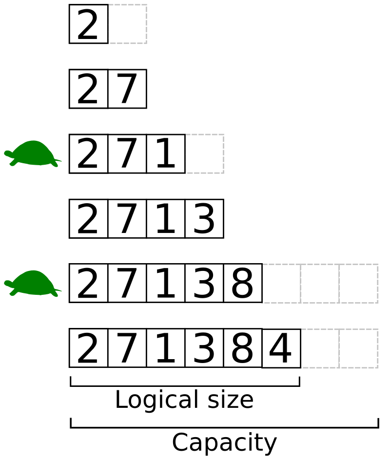

# 🧠 Estrutura de Dados: Linked List vs Array

---

## 🧩 Por que Arrays começam em 0?

Arrays geralmente começam em 0 porque isso simplifica o cálculo do endereço de memória:

> **Fórmula:**  
> `Endereço do elemento = Endereço base + (índice * tamanho do elemento)`

- Se o índice começar em 0, o primeiro elemento está no endereço base (`0 * size = 0`).
- Se começasse em 1, seria necessário um ajuste adicional no cálculo.

### 🔧 Exemplo (suponha que 1 elemento ocupa 16 bytes):

| Índice | Cálculo de Endereço              | Offset (Hex) |
|--------|----------------------------------|--------------|
| 0      | Base + (0 * 16) = Base           | 0x00         |
| 1      | Base + (1 * 16) = Base + 16      | 0x10         |
| 2      | Base + (2 * 16) = Base + 32      | 0x20         |

---

## 📦 Alocação de Array na Memória

Arrays são blocos contínuos de memória com tamanho fixo. Isso permite:

- 📖 Acesso instantâneo (`O(1)`)
- Fácil cálculo de tamanho (sabendo início e fim)
- Excelente localidade de cache (cache locality)

> 🔥 Importante: Máquinas modernas leem a memória em blocos (cache lines), então dados contíguos são mais rápidos de acessar.

---

## 🔄 Crescimento de Arrays

Quando um array precisa crescer:

1. Verifica-se se há espaço após o bloco atual.
2. Se não houver espaço, realoca-se para outra área com mais espaço contíguo.
3. Todos os elementos precisam ser copiados.

> 💸 **Custo de realocação no pior caso:** `O(n)`

### 📊 Ilustração: Realocação de Array

ANTES (fim da memória adjacente):  
`[10][20][30]`

PRECISA CRESCER → realocar!  

DEPOIS:  
`[10][20][30][40][..][..]`

---
### 🧠 Portanto:
Custo total da inserção no meio = busca (`O(n)`) + inserção (`O(1)`) = **`O(n)`**

---

## ⚖️ Comparação: Array vs Linked List

| Característica         | Array              | Linked List         |
|------------------------|--------------------|---------------------|
| Alocação de memória    | Contígua           | Dinâmica, dispersa  |
| Acesso por índice      | `O(1)`             | `O(n)`              |
| Inserção no início     | `O(n)`             | `O(1)`              |
| Inserção no fim        | `O(1)*` ou `O(n)`  | `O(1)*`             |
| Inserção no meio       | `O(n)`             | `O(n)`              |
| Remoção no meio        | `O(n)`             | `O(n)`              |
| Tamanho conhecido      | Sim                | Não (precisa percorrer) |
| Redimensionamento      | Custo elevado      | Não necessário      |

> 📌 *A inserção no fim pode ser `O(1)` se houver espaço (array) ou se mantivermos o ponteiro `tail` (lista).*

---

## 🖼️ Imagens para Visualização

### ✅ Array e Realocação:



---

### ✅ Linked List Simples e Dupla:


--

## 📈 Resumo de Complexidade — Array

| Operação           | Complexidade     |
|--------------------|------------------|
| Acesso direto      | `O(1)`           |
| Inserção no fim    | `O(1)*` ou `O(n)`|
| Inserção no meio   | `O(n)`           |
| Deleção            | `O(n)`           |
| Realocação         | `O(n)`           |

> ℹ️ *Inserção no fim pode ser `O(n)` no pior caso (realocação), mas `O(1)` na média.*

---

## 🔗 Linked List

Uma **linked list** (lista ligada) é uma estrutura onde cada **nó** contém:

- Um **valor (data)**
- Ponteiros para o próximo (e opcionalmente para o anterior)

---

## 🧭 Como funciona na memória?

Diferente dos arrays, os nós:

- **Não estão em locais contíguos**
- Cada nó contém um **ponteiro para o próximo**

### 🧬 Ilustração

#### Lista Simples:
`[data][ptr] -> [data][ptr] -> [data][NULL]`

#### Lista Duplamente Ligada:
`[NULL]<->[data]<->[data]<->[data]<->[NULL]`

---

## 🧠 Complexidade de Operações — Linked List

| Operação           | Complexidade        |
|--------------------|---------------------|
| Acesso por índice  | `O(n)`              |
| Inserção no início | `O(1)`              |
| Inserção no fim*   | `O(1)`              |
| Inserção no meio   | `O(n)`              |
| Remoção no início  | `O(1)`              |
| Remoção no meio    | `O(n)`              |
| Tamanho da lista   | `O(n)`              |

> 🔍 *Inserção no fim assume que mantemos uma referência (`tail`) ao último nó.*

---

## ⚖️ Comparação: Array vs Linked List

| Característica         | Array        | Linked List        |
|------------------------|--------------|--------------------|
| Alocação de memória    | Contígua     | Dinâmica, dispersa |
| Acesso por índice      | `O(1)`       | `O(n)`             |
| Inserção no início     | `O(n)`       | `O(1)`             |
| Inserção no fim        | `O(1)*` ou `O(n)` | `O(1)*`     |
| Inserção no meio       | `O(n)`       | `O(n)`             |
| Remoção no meio        | `O(n)`       | `O(n)`             |
| Tamanho conhecido      | Sim          | Não (`O(n)`)       |
| Redimensionamento      | Custo alto   | Não necessário     |

---

## 🔧 Alocadores e Overhead de Ponteiros

Cada nó de uma linked list geralmente possui a seguinte estrutura em C:

```c
struct Node {
   int value;         // 4 bytes
   struct Node* next; // 8 bytes (em sistemas 64 bits)
};
```

📦 **Overhead estimado**:  
- 4 bytes (valor) + 8 bytes (ponteiro) = **12 bytes por nó**  
- Pode haver **alinhamento de memória**, elevando o total para 16 bytes

🔢 **Array de `int` puro**:  
- Ocupa `4 * n` bytes para `n` elementos
- Sem overhead de ponteiros

---

## 📥 Inserção Ordenada

Linked lists são **ótimas para manter listas ordenadas dinamicamente**:

- ✅ Inserção ordenada → **ajuste simples de ponteiros**
- ❌ Arrays exigem **deslocamento de elementos** → custo `O(n)`

---

## ⛓️ Variantes de Linked Lists

### 🔁 Circular Linked List
- O último nó aponta de volta para o **primeiro**

### 🪜 Skip List
- Cada nó pode apontar para múltiplos níveis (camadas)
- Otimiza buscas: acesso rápido (`O(log n)` em média)

### 🧠 XOR Linked List
- Armazena `XOR(prev, next)` em vez de dois ponteiros
- Menor uso de memória, mas **muito complexa de manipular**

---

## 🧪 Cuidados com Ponteiros e `NULL`

- ❌ Acessar `next` de um nó `NULL`
- ❌ Esquecer de atualizar `prev` em listas duplas
- ❌ Deixar nós “órfãos” → **vazamento de memória**

✅ Boas práticas:
- Verificar ponteiros (`!= NULL`)
- Liberar memória com `free()`
- Atualizar ambos os lados da conexão (listas duplas)

---

## 📚 Estruturas com Arrays Dinâmicos

| Linguagem | Estrutura       |
|----------:|-----------------|
| C++       | `std::vector`   |
| Java      | `ArrayList`     |
| Rust      | `Vec`           |
| Python    | `list`          |

Essas estruturas crescem automaticamente (ex: dobrando capacidade) com inserção média no fim = `O(1)`.

---

## 🧠 Extras Importantes

### 📌 Cache Locality

- Arrays aproveitam cache devido à alocação contígua
- Linked lists causam mais **cache misses**

### 🧹 Coleta de Lixo

- Em linguagens com GC (como Java, Python), o gerenciamento de memória de listas ligadas é facilitado.
- Em C/C++, é responsabilidade do desenvolvedor liberar memória.

### 🧮 Listas em Linguagens Funcionais

- Em Haskell ou Lisp, listas são **imutáveis** e funcionam mais como linked lists persistentes.

---

## ✅ Conclusão Final

| Objetivo                        | Estrutura Ideal   |
|--------------------------------|-------------------|
| Acesso direto por índice       | Array / Vector    |
| Inserções/remoções frequentes  | Linked List       |
| Ordenação dinâmica             | Linked List       |
| Uso funcional / imutável       | Lista funcional   |
| Uso intensivo de cache         | Array             |
